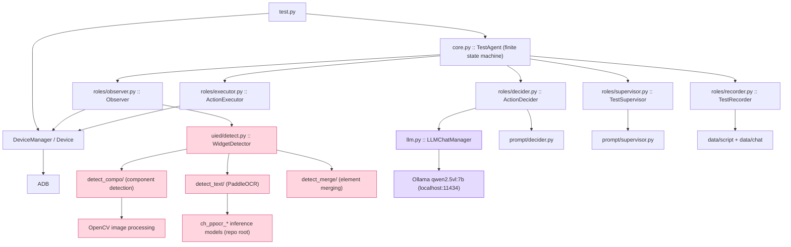

# ScenGen Architecture

> Terminology: `LLM` in file/class names (e.g. `llm.py`, `LLMChatManager`, `SCENGEN_LLM`) means the local **Qwen2.5-VL vision-language model (VLM)** served by Ollama.

ScenGen is an **LLM-guided scenario-based GUI testing** system for Android apps. It drives an app through
a user-defined scenario (e.g. "send an email", "calculate 8+5"), observing each screen, deciding the next
action with a local vision-language model, and executing it on the device through ADB.

A single `TestAgent` orchestrates five role agents using a finite state machine. The model
(`qwen2.5vl:7b`, served locally by Ollama) is **multimodal** — screenshots are sent to it as base64
images alongside structured widget lists produced by computer vision (UIED + PaddleOCR), which the
model reasons about jointly.

---

## 1. Component overview



**Layers**

| Layer | Modules | Responsibility |
|---|---|---|
| Entry | `test.py` | Parse `<APP-ID> <SCENARIO-ID>`, build device + agent, run the step loop |
| Orchestrator | `core.py` | `TestAgent` finite state machine coordinating all roles |
| Roles | `roles/` | Observer, ActionDecider, ActionExecutor, TestSupervisor, TestRecorder |
| Shared infra | `memory.py`, `llm.py`, `device.py`, `config.py`, `utils.py`, `logger.py`, `prompt/` | State, VLM calls, ADB ops, registry, helpers, prompts |
| CV pipeline | `uied/` | Convert screenshots into detected widgets + marked image |
| Data | `apps.json`, `scenarios.json`, `data/` | App/scenario registry + runtime artifacts |
| External | Ollama, ADB, PaddleOCR models | VLM reasoning, device control, OCR inference |

---

## 2. Code-file dependency diagram

Arrows mean **imports / uses**. All paths are under `scen/testbot/`; an identical parallel copy also lives at
the repo root `testbot/` (see note below).

```mermaid
flowchart TD
    subgraph ENTRY
        T["test.py"]
    end

    subgraph ORCH["orchestrator"]
        CORE["core.py :: TestAgent (FSM)"]
    end

    subgraph ROLES["roles/"]
        OBS["observer.py :: Observer"]
        DEC["decider.py :: ActionDecider"]
        EXE["executor.py :: ActionExecutor"]
        SUP["supervisor.py :: TestSupervisor"]
        REC["recorder.py :: TestRecorder"]
    end

    subgraph INFRA["shared infra"]
        MEM["memory.py :: Memory"]
        LLM["llm.py :: LLMChatManager"]
        DEV["device.py :: Device / DeviceManager"]
        CFG["config.py :: APPS, SCENARIOS"]
        UTIL["utils.py"]
        LOG["logger.py"]
        PROMPT_D["prompt/decider.py"]
        PROMPT_S["prompt/supervisor.py"]
    end

    subgraph CV["uied/ (widget detection)"]
        DET["detect.py :: WidgetDetector"]
        COMPO["detect_compo/ip_region_proposal.py"]
        TEXT["detect_text/text_detection.py"]
        OCR["detect_text/ocr.py :: OCRDetector"]
        TCLS["detect_text/Text.py"]
        MERGE["detect_merge/merge.py"]
        ELEM["detect_merge/Element.py"]
        LIBS["detect_compo/lib_ip/*"]
        CU["CONFIG_UIED.py"]
    end

    subgraph DATA["config data"]
        APPS_JSON["apps.json"]
        SCEN_JSON["scenarios.json"]
        CONF_JSON["conf.json (fallback)"]
    end

    subgraph EXT["external"]
        OLLAMA["Ollama qwen2.5vl:7b / localhost:11434"]
        ADB["ADB / Android device"]
        PAD["PaddleOCR inference models (repo root ch_ppocr_* dirs)"]
    end

    T --> CORE
    T --> DEV
    CORE --> MEM & DEV & LLM & CFG & LOG
    CORE --> OBS & DEC & EXE & SUP & REC

    OBS --> DEV & LLM & DET
    DEC --> LLM & MEM & PROMPT_D & UTIL
    EXE --> DEV & REC & MEM
    SUP --> LLM & MEM & PROMPT_S & UTIL
    REC --> LLM & MEM & UTIL

    MEM --> LOG
    LLM --> LOG
    DEV --> UTIL & LOG
    PROMPT_D --> MEM
    PROMPT_S --> MEM
    CFG --> APPS_JSON & SCEN_JSON & CONF_JSON

    DET --> COMPO & TEXT & MERGE & CU
    COMPO --> LIBS & CU
    TEXT --> OCR & TCLS & UTIL
    MERGE --> ELEM

    LLM --> OLLAMA
    DEV --> ADB
    OCR --> PAD

    classDef entry fill:#d4e4ff,stroke:#2b6cb0
    classDef orch fill:#ffe8cc,stroke:#dd6b20
    classDef roles fill:#d3f9d8,stroke:#2f9e44
    classDef infra fill:#e5dbff,stroke:#7c3aed
    classDef cv fill:#ffd6e0,stroke:#d6336c
    classDef data fill:#fff3bf,stroke:#e67700
    classDef ext fill:#f1f3f5,stroke:#868e96
    class T entry
    class CORE orch
    class OBS,DEC,EXE,SUP,REC roles
    class MEM,LLM,DEV,CFG,UTIL,LOG,PROMPT_D,PROMPT_S infra
    class DET,COMPO,TEXT,OCR,TCLS,MERGE,ELEM,LIBS,CU cv
    class APPS_JSON,SCEN_JSON,CONF_JSON data
    class OLLAMA,ADB,PAD ext
```



> **Note on duplicated packages:** the project contains two parallel, identical copies — the real package
> `scen/testbot/` and a copy at the repo root `testbot/`. Root `test.py` imports the root copy;
> `scen/test.py` imports the `scen` copy. Keep edits in sync across both.

---

## 3. Agent state machine

`TestAgent` (`core.py`) drives the test as a finite state machine. The states handle retries, waiting for
loading, validating action effects, and error recovery via the `CORRECTING` state.

```mermaid
stateDiagram-v2
    [*] --> INITIALIZED
    INITIALIZED --> OBSERVING
    OBSERVING --> EXECUTING: decide next action
    EXECUTING --> LOAD-CHECKING
    LOAD-CHECKING --> OBSERVING: loading (retry / wait)
    LOAD-CHECKING --> EFFECT-CHECKING: not loading
    EFFECT-CHECKING --> END-CHECKING: valid effect
    EFFECT-CHECKING --> CORRECTING: invalid effect
    CORRECTING --> EXECUTING: corrected action
    CORRECTING --> FAILED: too many failures
    END-CHECKING --> OBSERVING: task not finished
    END-CHECKING --> END: task finished
    OBSERVING --> ERROR
    EXECUTING --> ERROR: no executable command
    [*] --> ERROR: launch verification failed
    END --> [*]
    FAILED --> [*]
    ERROR --> [*]
```

---

## 4. One-iteration sequence

The inner loop of a test run. `test.py` calls `agent.step()` until the state reaches `END`, `FAILED`, or `ERROR`.

```mermaid
sequenceDiagram
    participant Test as test.py
    participant Agent as TestAgent
    participant Obs as Observer
    participant Det as WidgetDetector (uied)
    participant Dec as ActionDecider
    participant Exe as ActionExecutor
    participant Sup as TestSupervisor
    participant Dev as DeviceManager/ADB
    participant LLM as Ollama (qwen2.5vl:7b)
    participant Rec as TestRecorder

    Test->>Agent: step()
    Agent->>Obs: capture_screenshot()
    Obs->>Dev: screencap + pull
    Dev-->>Obs: screenshot path
    Agent->>Obs: detect_widgets(path)
    Obs->>Det: detect()
    Det->>Det: compo detection + OCR text + merge
    Det-->>Obs: marked image, resize_ratio, elements[]
    Agent->>Dec: next_action(memory)
    Dec->>LLM: prompt (action decision)
    LLM-->>Dec: {intent, action-type, ...}
    Dec->>LLM: confirm target widget (marked image)
    LLM-->>Dec: target-widget-number
    Agent->>Exe: execute(memory)
    Exe->>Dev: adb tap/input/swipe/back
    Agent->>Sup: check_loading(memory)
    Sup->>LLM: loading check
    LLM-->>Sup: T/F
    alt loading
        Exe->>Dev: wait, retry
    else not loading
        Agent->>Sup: check_effect(memory)
        Sup->>LLM: valid change check
        LLM-->>Sup: YES/NO
        alt invalid
            Agent->>Agent: CORRECTING (re-decide / rematch)
        else valid
            Agent->>Sup: check_end(memory)
            Sup->>LLM: ending check
            LLM-->>Sup: T/F
        end
    end
    Agent->>Rec: record(action, memory)
    Rec-->>data/script, data/chat: JSON + chat log
```

---

## 5. Evaluation (VLM-based runtime reasoning)

**The project now uses a vision-language model at runtime.** The model is `qwen2.5vl:7b` served by
Ollama's `/api/generate` endpoint (`llm.py`), and it is multimodal.

- Prompts are built as `{"text": ..., "image": <path>}`; `LLMChatManager` now collects the image paths
  from the stacked context messages in append order (`llm.py: _context_images`), base64-encodes them
  (`_encode_image`), and attaches them to the Ollama request payload's **`images` field**, so the model
  sees the actual screenshot pixels alongside the serialized widget lists.
- Structured output is enforced per stage with JSON schemas sent through Ollama's `format` parameter
  (`llm.py: _json_schema_for_prompt`).

Consequently there are two very different notions of "evaluation":

### 5.1 Runtime validation (VLM visual reasoning)

`TestSupervisor` (`roles/supervisor.py`) performs three checks during each iteration:

| Check | Prompt stage | Question | On result |
|---|---|---|---|
| Loading | `loading-check` | Is the page loading? (blank / "loading" / latency) | wait + retry |
| Effect | `visual-change-check`, `valid-change-check` | Did the action cause a valid (scenario-oriented) page change? | invalid → `CORRECTING` |
| Ending | `ending-check` | Is the task completed? | done → `END` |

These are **VLM visual judgments** built from the task description, the performed-actions history,
the UIED+PaddleOCR widget lists, and the actual screenshot pixels (1–3 ordered screenshots per check).
They are heuristic, not metric-based.

### 5.2 Metric-based evaluation (OCR model only)

Quantitative evaluation exists **only for the OCR model**, inside the isolated `ocr_lab/` lane:

- `ocr_lab/scripts/run_ocr_benchmark.py` — runs a model over benchmark screenshots.
- `ocr_lab/scripts/compare_benchmarks.py` — computes char accuracy (Levenshtein-based) and exact-match rate
  against ground truth, with baseline-vs-candidate deltas.
- `ocr_lab/scripts/train_rec_model.py --run-eval` — invokes PaddleOCR `tools/eval.py` on a validation set.

### 5.3 Non-real evaluation

- `demo_train_run.py` — a classroom-safe simulation that prints fake `confidence / accuracy / loss /
  validation_score` metrics. It does not train anything and does not touch the real pipeline.
- `data/bug/` is a placeholder — there is no automatic bug-detection or bug-report evaluation pipeline.

---

## 6. Module reference

### 6.1 Orchestrator & roles (`testbot/`)

| File | Key API | Responsibility |
|---|---|---|
| `core.py` | `TestAgent.step()`, `_state_*()` | FSM coordinator; retry/error counters; issue table |
| `roles/observer.py` | `Observer.capture_screenshot()`, `detect_widgets()` | Capture (rotate-aware) + invoke widget detection with retry |
| `roles/decider.py` | `ActionDecider.next_action()`, `confirm_next_action()`, `rematch_next_action()` | VLM action decision + widget matching; deterministic calculator/camera planners |
| `roles/executor.py` | `ActionExecutor.execute()`, `click/input/scroll/back` | Translate actions into device commands; undo logic |
| `roles/supervisor.py` | `TestSupervisor.check_loading/check_effect/check_end()` | VLM visual validation of loading, effect, and completion |
| `roles/recorder.py` | `TestRecorder.record()`, `scripted()` | Persist action history; export replayable script + chat log |

### 6.2 Shared infrastructure

| File | Key API | Responsibility |
|---|---|---|
| `device.py` | `Device`, `DeviceManager.op_click/op_input/op_scroll/...` | ADB wrapper; app lifecycle; screencap; resolution + resize-ratio mapping |
| `memory.py` | `Memory.cache_screenshot/add_action/describe_*` | Session state: screenshots (initial/prev/current), elements, actions, basic info |
| `llm.py` | `LLMChatManager.get_response()`, per-stage `ChatContext` pool | Ollama VLM client; multimodal image attachment (`images` field); JSON-schema structured output (`format`); response normalisation |
| `config.py` | `APPS`, `SCENARIOS` | Load registry from `apps.json` + `scenarios.json` (fallback `conf.json`) |
| `utils.py` | `extract_json`, `remove_punctuation`, `literally_related` | JSON/string helpers for VLM output parsing and text matching |
| `logger.py` | `logger`, `init_logger` | File + console logging to `agent.log` |
| `prompt/decider.py` | `system_prompt_next_action`, `user_prompt_*` | Prompt templates for action decision / widget matching |
| `prompt/supervisor.py` | `system_prompt_*`, `user_prompt_*` | Prompt templates for loading / effect / ending checks |

### 6.3 CV pipeline (`uied/`)

| File | Responsibility |
|---|---|
| `detect.py` | `WidgetDetector` — orchestrates compo → text → merge; resolves output dir automatically |
| `detect_compo/ip_region_proposal.py` + `lib_ip/*` | Component detection via gradient binarization + flood-fill region proposal (OpenCV) |
| `detect_text/text_detection.py` | PaddleOCR text detection; filter/noise removal; sentence merging |
| `detect_text/ocr.py` | `OCRDetector` — PaddleOCR model registry (mobile/server/PP-OCRv2/trad-Chinese/finetuned) + env overrides |
| `detect_text/Text.py` | Text element model (bbox merging, justification) |
| `detect_merge/merge.py` | Merge components + text into widgets; remove fragments; draw marked image |
| `detect_merge/Element.py` | Widget element model (bbox, containment, children) |
| `CONFIG_UIED.py` | Frozen CV thresholds + colour map |

---

## 7. Data flow and artifacts

```
data/
├── input/     screenshots pulled from the device (screenshot-<ts>.png)
├── output/
│   ├── ip/       component detection JSON   (name.json)
│   ├── ocr/      OCR detection JSON + PNG   (name.json, name.png)
│   └── merge/    merged widgets JSON + marked screenshot (name.json, name.jpg)
├── script/    replayable test script JSON (S<n>-A<m>-<ts>.json)
├── chat/      full VLM conversation logs (S<n>-A<m>-<ts>-chat.txt)
├── xml/       (reserved) UI hierarchy dumps
├── apk/       pulled APK files
├── bug/       placeholder
└── log/       runtime logs
```

**Action/script JSON format** (`roles/recorder.py`): each recorded action contains `action-type`
(`touch`/`input`/`scroll`/`back`/`wait`/`start`/`end`), `intent`, resolved `target-widget` (with `position`
bbox), optional `input-text`/`scroll-direction`, the executed ADB `command`, and the associated screenshot.

---

## 8. External dependencies

| Dependency | Used by | Purpose |
|---|---|---|
| Ollama + `qwen2.5vl:7b` | `llm.py` | Multimodal (vision+text) reasoning loop (`localhost:11434/api/generate`) |
| ADB / platform-tools | `device.py` | Device control: tap, input, swipe, screencap, app lifecycle |
| Android device (USB/Wi-Fi) | `device.py` | Device under test |
| PaddleOCR models (`ch_ppocr_*` dirs) | `uied/detect_text/ocr.py` | OCR text detection/recognition (CPU) |
| OpenCV | `uied/detect_compo/*`, `uied/detect_merge/*` | Component detection and image drawing |
| `ocr_lab/` | dev only | OCR benchmarking + fine-tuning lane (separate from the runtime) |

---

## 9. Key design decisions

- **VLM visual reasoning.** Screenshots are sent as actual image pixels (base64 via Ollama `images` field) together with structured widget lists from CV; Qwen2.5-VL reasons over both jointly. Supervisor checks receive 1–3 ordered screenshots.
- **Deterministic planners.** For `calculate <expr>` scenarios, `ActionDecider` parses the expression and
  presses keys inferred from a detected keypad grid (no VLM call per key). Camera "take photo" scenarios use
  a fixed shutter-region heuristic.
- **Text-match fast path.** `confirm_next_action` first tries to match the target widget by OCR text /
  resource id before asking the VLM to identify it visually on the marked image.
- **Self-healing loop.** Failed effects trigger `CORRECTING` with a bounded retry counter that either
  rematches the widget or re-decides the action; repeated failures end the run as `FAILED`.
